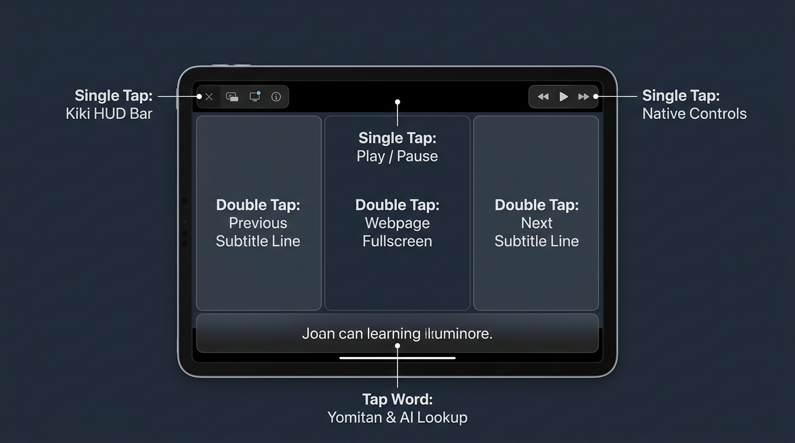

# Kiki Immersion

> *Touch & Mouse YouTube Immersion with Yomitan Dictionary Lookup, Translucent Liquid Glass Subtitles, AI Contextual Engine & Dynamic Hot-Reload.*

    

---

## 🚀 One-Click Installation

Installing Kiki Immersion is fully automated across all modern desktop and mobile browsers via userscript managers:

👉 **[Click Here to Install Kiki Immersion (loader.user.js)](https://raw.githubusercontent.com/kekeqwq/Kiki-Immersion/main/loader.user.js)**

- **Safari (iOS / iPadOS / macOS via Userscripts extension)**:  
  Tap or open the link above in Safari. The **Userscripts** extension panel will automatically detect the script and prompt an **Install** button. Tap **Install** to finish.
- **Chrome / Brave / Edge (via Tampermonkey / Violentmonkey)**:  
  Clicking the link will automatically open Tampermonkey's native installer interface. Click **Install** to finish.

*(Optional Standalone Bundle: If you prefer an entirely offline monolithic userscript without dynamic module fetching from GitHub, you can install [`dist/kiki-immersion.user.js`](https://raw.githubusercontent.com/kekeqwq/Kiki-Immersion/main/dist/kiki-immersion.user.js)).*

---

## 📖 Initial Setup & Dictionary Installation

> [!IMPORTANT]
> **To start looking up words, you must first install offline Yomitan dictionaries (`.zip` format) into the browser storage.**

### 1. YouTube Setup (Primary Platform)
1. Open **any YouTube video** in your browser.
2. Click or tap **⚙️ Settings** on the top Kiki HUD bar (or tap any subtitle word, then tap the Settings gear icon in the card header).
3. Switch to the **📖 Dictionaries** tab.
4. Drag and drop or browse to import your Yomitan `.zip` dictionary archives (e.g., *JMdict*, *Kenkyusha*, *OALD*, *Cambridge*, *Daijirin*, etc.).
5. The dictionaries are parsed and stored locally in browser offline storage (IndexedDB) with zero external network requests during lookup.

### 2. Universal Web Reading Setup (LingQ, News, Articles)
- Kiki Immersion is primarily crafted for **YouTube video immersion**, but also provides full **Universal Web Word Lookup** across all websites.
- **Per-Domain Storage Isolation**: Because web browsers enforce origin-isolated storage (IndexedDB / localStorage), dictionaries installed on `youtube.com` are sandboxed to YouTube.
- To use dictionary lookup on any other website (e.g., **LingQ**, Wikipedia, web readers):
  1. Open your target website.
  2. Hold the **`Ctrl`** key (or your customized modifier key configured in settings: `Ctrl`, `Alt/Option`, `Cmd/Meta`) and **click ANY word** on the page.
  3. The Yomitan floating card will appear. Click the **⚙️ Settings** icon in the card header.
  4. Go to **📖 Dictionaries** and import your dictionary `.zip` files for that site.
  5. Once imported, simply hold `Ctrl` and click any word to inspect definitions, play pronunciations, or explore AI contextual explanations instantly!

---

## 👆 Touch & Gesture Controls Guide

Kiki Immersion features a touch-first design built specifically for iPad, tablet, and touch-screen immersion. The player is divided into responsive touch zones:



### Gesture Mapping Reference

| Screen Area / Gesture | Action | Description |
| :--- | :--- | :--- |
| **Subtitle Word Tap** | `Yomitan & AI Lookup` | Tap any word in the subtitle line to instantly open Yomitan definitions, pitch accent, audio pronunciation, and AI context. |
| **Double Tap (Left 28%)** | `← Previous Subtitle Line` | Instantly jump playback to the start of the previous subtitle line. |
| **Double Tap (Center 44%)** | `Webpage Fullscreen` | Smoothly toggles seamless webpage fullscreen mode. |
| **Double Tap (Right 28%)** | `Next Subtitle Line →` | Instantly advance playback to the next subtitle line. |
| **Single Tap (Top-Left 18%)** | `Toggle Kiki HUD Bar` | Shows or hides the top floating controller bar (Settings, Subtitles, CC Track selector, Reload). |
| **Single Tap (Top-Right 18%)** | `Toggle Native Controls` | Reveals YouTube's native player controls overlay. |
| **Single Tap (Center)** | `Play / Pause` | Toggles video playback smoothly with gesture debounce protection. |
| **Dismiss Lookup Card** | `Tap Outside Card` | Tapping anywhere outside an active dictionary/AI popup immediately dismisses it and cleanly resumes playback. |

### Keyboard Shortcuts (Desktop / Hardware Keyboards)
- **`A`**: Jump to previous subtitle line.
- **`D`**: Jump to next subtitle line.
- **`Space`**: Smooth Play / Pause toggle without page scroll.
- **`Ctrl + Click`** (on any web text or YouTube comments): Trigger instant Yomitan & AI lookup card.

---

## ✨ Features & Highlights

1. **Dual-Theme Liquid Glass UI (Dark & Light Modes)**
   - **Liquid Glass Dark**: Deep translucent obsidian glass with vibrant neon badges and smooth backdrop blur.
   - **Liquid Glass Light**: Pristine white translucent glass with crisp typography, designed to follow macOS and Windows system color schemes automatically (or manually toggleable in settings).

2. **First-Party Offline Yomitan Dictionary & Audio Engine**
   - High-performance client-side IndexedDB dictionary parser supporting standard Yomitan / Yomichan `.zip` files.
   - Offline audio pronunciation playback and pitch accent visual graphs.
   - Multi-word compound matching and automatic Japanese deinflection / English lemmatization.

3. **Contextual AI Explanations & Multi-Turn Chat**
   - OpenAI-compatible API support (DeepSeek, GPT-4o-mini, Claude, Ollama, etc.).
   - Automatically injects the clicked word and the exact video subtitle sentence context.
   - **Interactive Exploration Pills**: MarginNote 4 style one-tap exploration pills tailored to your sentence.
   - **Multi-Turn Chat**: Follow-up questions with full conversation memory directly inside the lookup card.

4. **Rock-Solid Subtitle Pipeline**
   - YouTube PoToken bypass via native authenticated Transcript panel extraction.
   - Automatic subtitle line synchronization and track switching.
   - Multi-word phrase matching and highlight in subtitles.

---

## 🛠 Project Structure

```text
Kiki-Immersion/
├── loader.user.js            # Universal auto-updating loader script
├── assets/
│   └── gesture_guide.jpg     # Touch gesture illustration diagram
├── modules/                  # Modular engine source code
│   ├── core.js               # State, theme management, base styles & utilities
│   ├── yomitan.js            # Yomitan offline IndexedDB dictionary & audio
│   ├── ai.js                 # AI explanation engine, streaming & exploration pills
│   ├── ui.js                 # HUD bar, card layout, settings & update modal
│   ├── web.js                # Universal non-intrusive web word lookup
│   └── youtube.js            # YouTube DOM adapter, subtitle sync & touch gestures
├── manifest.json             # Module registry and metadata manifest
├── scripts/                  # Build and bundling scripts
│   ├── bundle.py             # Generates dist single-file bundle
│   └── build_all.py          # Build and sync utilities
└── dist/
    └── kiki-immersion.user.js # Standalone monolithic bundle (fully offline)
```

---

## 📄 License

GPL-3.0 License. Open-source touch-first immersion player for YouTube and the modern web.
